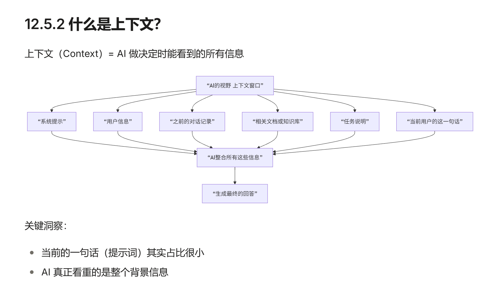

11.2.2 BROKE 模型拆解
B (Background) 背景：前因后果，给 AI 喂料。

    CEO 说：“咱们公司下个季度要进军日本市场...”

R (Role) 角色：指定人设，激活特定知识库。

    CEO 说：“你作为咱们的首席市场官...”

O (Objectives) 目标：要干什么。

    CEO 说：“你要给我出一份市场调研报告...”

K (Key Result) 关键结果：交付标准。

    CEO 说：“主要分析竞品的价格策略，要用数据说话，最后给我 3 个可行的定价建议，做成 PPT 大纲发我。”

E (Examples) 例子：打个样（可选，详情见 11.3.1 节 少样本提示）。

    CEO 说：“风格参考咱们去年做的那个北美市场报告。”

11.3.1 少样本提示：教它“照猫画虎”
有时候，你很难用语言描述清楚你要什么 风格。
最简单的办法是 直接给例子。

11.3.2 链式思考：逼它“把题算对”
这时候，你只要加一句咒语：
“请一步一步地思考（Let's think step by step）。”
这就像老师让学生写”解题步骤”并检查中间过程，错误更容易被及时发现

11.3.3 指定格式：不要让它乱发挥
养成一个好习惯：永远告诉 AI 你要的输出格式。
常用的格式咒语：
“用 Markdown 表格”（做对比神器）
“用 JSON 格式”（程序员神器）
“用 1, 2, 3 清单体”（做总结神器）
“用代码块”（复制粘贴方便）

管理 AI，其实就是管理学的缩影。

11.4.1 模糊是最大的敌人
用数字说话，不要用形容词。避免歧义

11.4.3 一次只做一件事
虽然 AI 记性好，但任务太杂也会导致 逻辑降智。
最好的办法是 拆分：
Conversation 1: 专门处理文案。
Conversation 2: 专门把文案翻译成英文。
Conversation 3: 专门把英文排版成表格。
保持对话（Context）的纯净度，AI 会表现得更好。

11.5.1 提示词无法跨越的五条鸿沟

第一条：知识边界
问题： LLM 的知识来自训练数据。如果训练数据里没有这个知识，再好的提示词也救不了。
解法：联网搜索、专用知识RAG

第二条：推理能力的极限
问题： LLM 善于模式识别，但在需要多步骤、深度逻辑推理的任务上，有隐形上限。
解法：给出中间过程的引导式提示，比如“我要包含什么方法的，要包含什么算法的”，让LLM有路径可以参考

第三条：一致性与对齐
问题： 强化学习对齐出来的 AI，总是在“做什么用户想要”和“坚守自己的边界”之间摇摆。
解法：？

第四条：多模态的盲区
问题： 即使是多模态 AI，对图像、音频、视频的理解仍有深刻局限。
解法：？

第五条：涌现能力的不可预测性
问题： 有些能力是 LLM 在特定规模才“忽然涌现”的。小规模模型怎么提示都无法做到。
解法：微调特化

11.5.2 常见失败模式与诊断

失败模式 1：幻觉
症状： AI 生成听起来很像真的，但完全是编造的信息。
为什么会发生？
    LLM 本质是“预测概率最高的下一个词”。
    它没有“真假检查”机制。
    当被问到它不确定的问题时，就会倾向于“说得自信的错误”。
解法：人工、多来源

失败模式 2：越狱与对齐逆转
症状： 虽然 AI 被“对齐”得很好，但特殊的提示词可以让它做出危险的事。
为什么会发生？
    RLHF 对齐改变了 LLM 的行为，但没有改变基础参数。
    LLM 仍然“知道”如何制造炸弹（在训练数据里）。
    对齐只是加了“决策层的拦截”。
    某些创意性的提示词可以绕过这个拦截。
已知的越狱技巧：
1. 角色扮演："假装你是..."
2. 虚拟场景："在一个游戏中..."
3. 正当理由："这是为了学术研究..."
4. 渐进式：先问"这合法吗"，再问"怎么做"，再问"代码是什么"
5. 外语："用中文回答以下问题..."（某些模型在非英文上对齐更松散）
解法：不是更好的提示词，而是 更好的对齐技术。DPO、RLVR 等新的对齐方法在尝试解决这个问题。长期来看，需要从“强化学习对齐”升级到“更深层的安全性”。

失败模式 3：背景知识的假设冲突
症状： AI 假设你有某些背景知识，结果答非所问。
解法：描述自己需要回答的程度，比如白话、专业术语

失败模式 4：输出格式的混乱
症状： 你要求结构化输出，AI 经常不按格式来。
解法：使用 JSON Schema 或 Pydantic 模型约束输出

11.5.4 混合方案：当一个方案不够时
现实中，最强大的解决方案往往是组合。
单纯的提示词优化已经遇到了天花板， 下一步是把 LLM 嵌入到更大的系统里（数据库、搜索、微调、监控）， 然后从整个系统的角度去优化。

