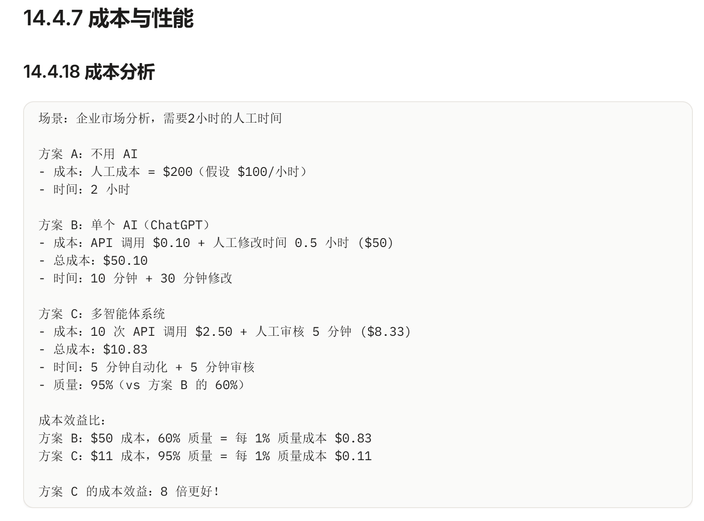

ReAct 是智能体最经典的思考模式。它要求 AI 在每一步行动前，先进行推理（Reasoning），行动（Acting）后，再观察结果（Observation）

14.2.4 智能体安全与评测：从“能跑”到“可上线”
很多智能体 Demo 看起来很惊艳，但离在真实业务中上线运行，还差了至关重要的 工程化与安全加固 步骤。

[!IMPORTANT] 智能体生产基线与工具协议风险

当企业基于 MCP（Model Context Protocol） 等标准化协议将内部知识库和系统工具大批量接入智能体后，系统的攻击面会指数级增加。例如，黑客可能通过在网页中隐藏恶意指令（提示词注入），诱骗智能体读取该页面后自动调用 MCP 工具执行删库命令（这被称为“链式工具利用”）。工业级部署必须满足三大基线：

评测体系（Evals）：传统的软件测试是给定输入看输出。但智能体每次的回答不同，解决问题路径也不同。需要建立一套专门的端到端测试集，评测其在这个任务上的 成功率、平均耗时、Token 成本。安全环节必须注入对抗性测试（Red-teaming）来验证它是否会被越狱骗走权限。

行动边界与防护（Guardrails）：

工具沙盒化与最小权限：确保给大模型的 API 密钥只拥有能完成任务的绝对最低权限（例如只读，而非读写）。

人类介入拦截（Human-in-the-loop）：对于诸如：转账、写库、发送公开邮件、执行系统命令等高危动作，禁止 AI 自动执行。在工具调用前，必须挂起进程并向人类发送通知进行 二次批准。

审计与可观测性（Observability）：必须像监控微服务一样监控智能体，全面记录：时间戳、Trace ID、意图识别结果、完整的输入输出参数、以及原始 API 响应耗时。一旦系统搞砸了或触发安全警报，工程师可以通过这些字段精准回放“案发现场”。

没有这三件套，智能体很容易停留在“演示可用、生产翻车”的隐患阶段。

有一个关键问题：无论是单智能体还是多智能体，如何让它们在真实业务中稳定可靠地运行？
智能体在生产环境中会遇到三大挑战：
挑战一：非确定性灾难
大模型有幻觉，调用 API 时容易出错，甚至陷入死循环
挑战二：环境复杂性
模型自身无法管理企业权限、无法持久化任务状态、没有错误重试机制
挑战三：可靠性要求
生产环境需要可审计、可控制、高稳定性的运行能力

这就是 驭具工程（Harness Engineering） 要解决的问题。
Harness 不是 AI 模型本身，而是包围、承载并驾驭模型的那一套运行环境和工程保障系统。
驭具的四大核心职能
1. 工具与权限编排
   → 管理模型可以调用哪些 API，拦截不合法的调用
2. 上下文动态管理
   → 在正确的时间把正确的信息"喂"给模型，避免信息过载
3. 反馈与纠错闭环
   → 模型犯错时自动捕获错误，转化为提示让模型自我纠正
4. 安全守卫（Guardrails）
   → 定义硬性规则限制模型行为底线（如：绝不外发财务数据）

